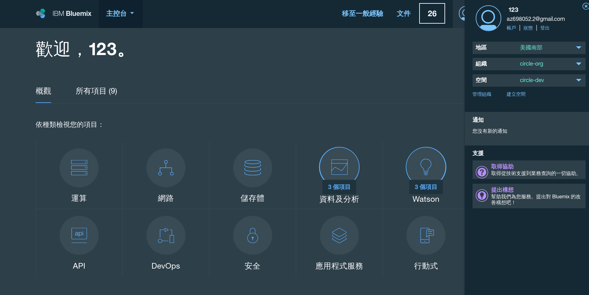
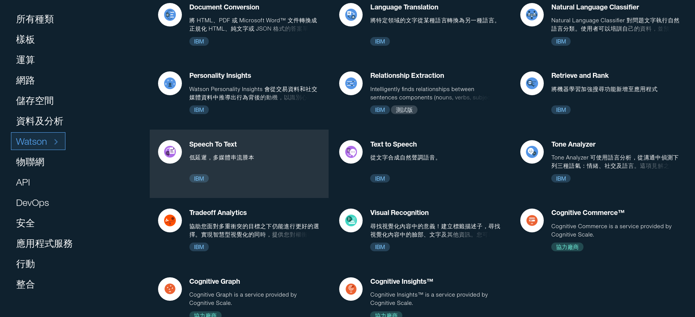
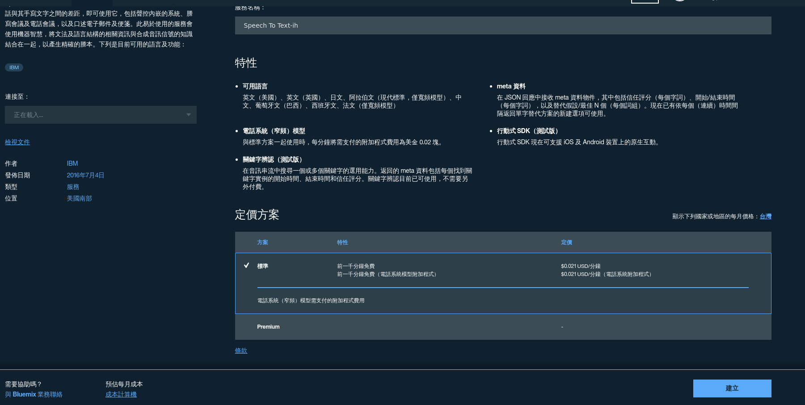
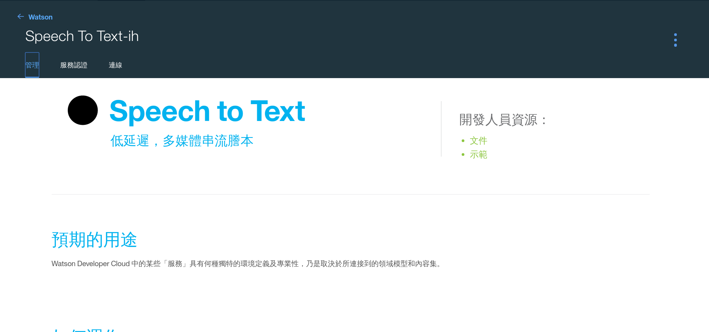

# This is a tutorial about how to build a dialog robot on 7688.


## Login in your Bluemix accout (see [Chap0](../chap0) for detail)

Remember to set your region to US South.

Now let us create a Bluemix Speech to Text service.



Click Watson and select Speech to Text service.







Save the credential to my-stt-credentials.json


## Deploy the app on 7688

First, download the app folder to 7688. Using scp or SD card is recommended.

Second, plug in USB sound card on 7688 USB port, and then connect microphone and speaker.

Finally, log in to 7688 and clone this repo,
and **replace the app/my-stt-credentials with your credentials**,
then launch the application in app folder.

```sh
git clone https://github.com/YuanYouYuan/Bluemix-tutorial.git
cd Bluemix-tutorial/7688/app
node app/app.js
```

