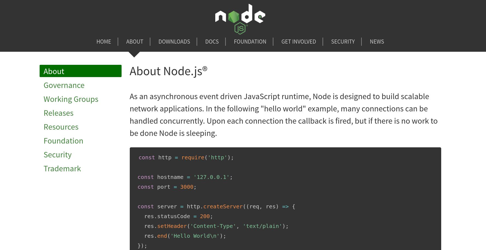
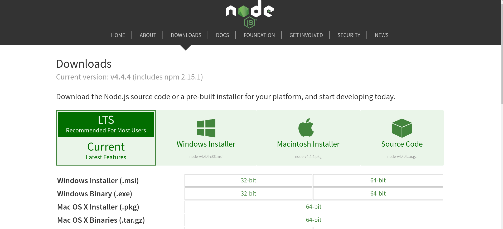
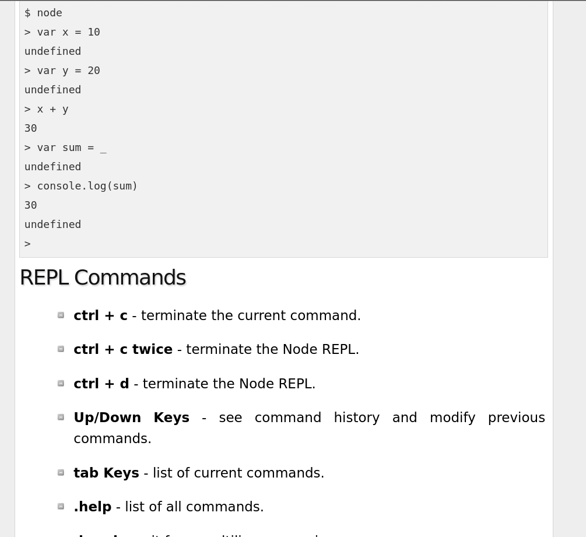
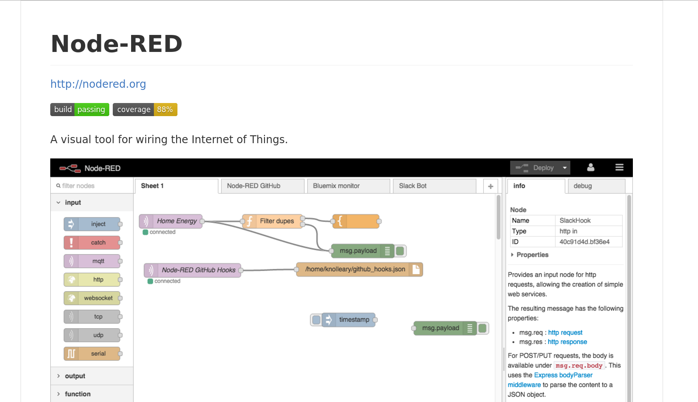
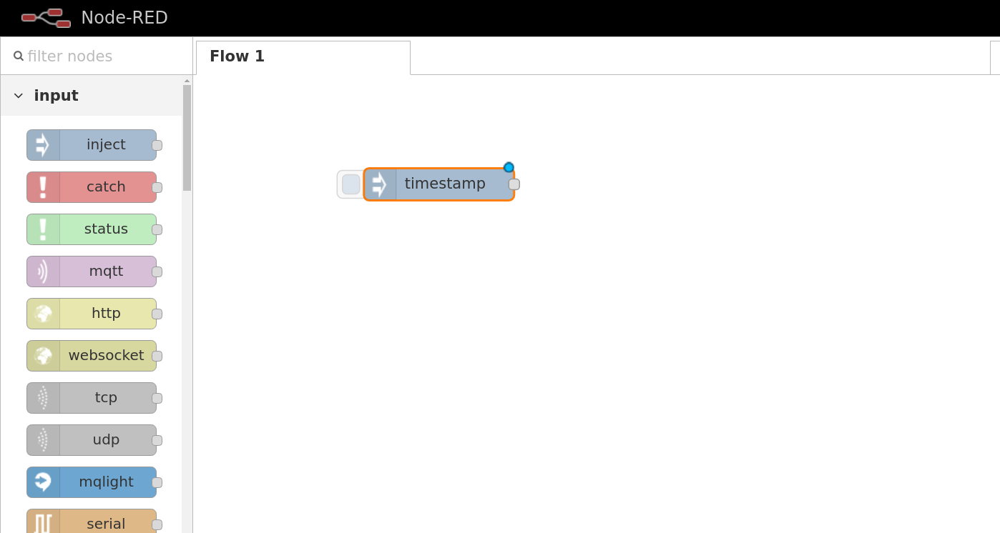
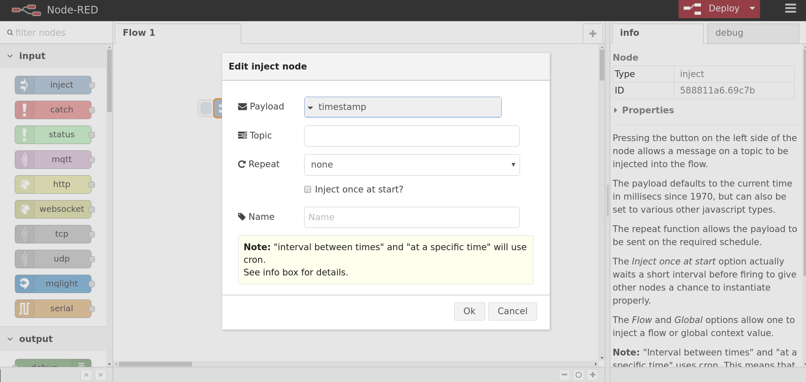
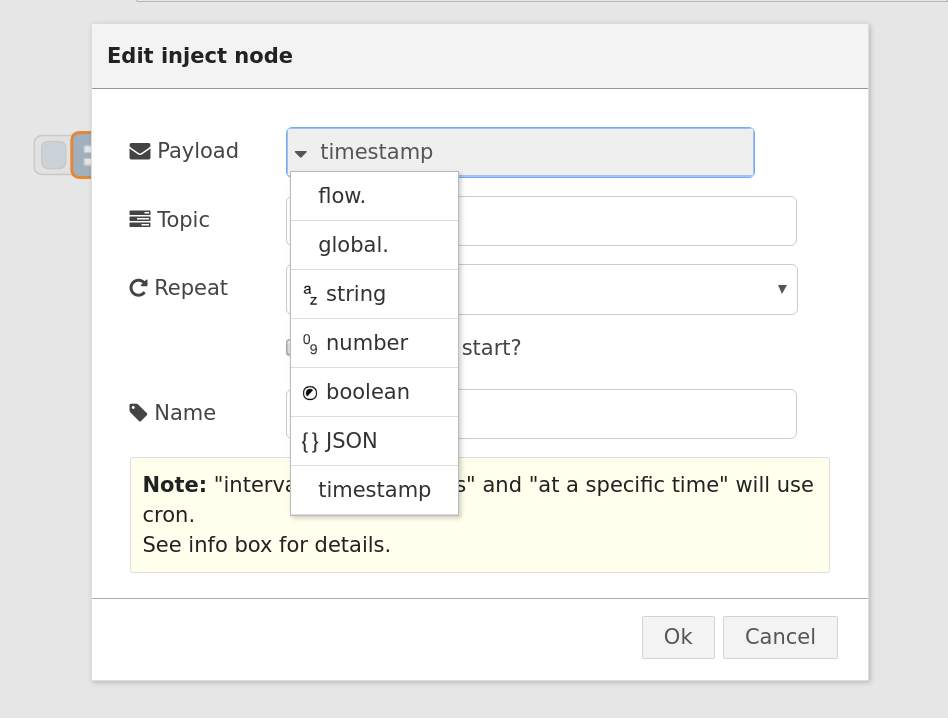
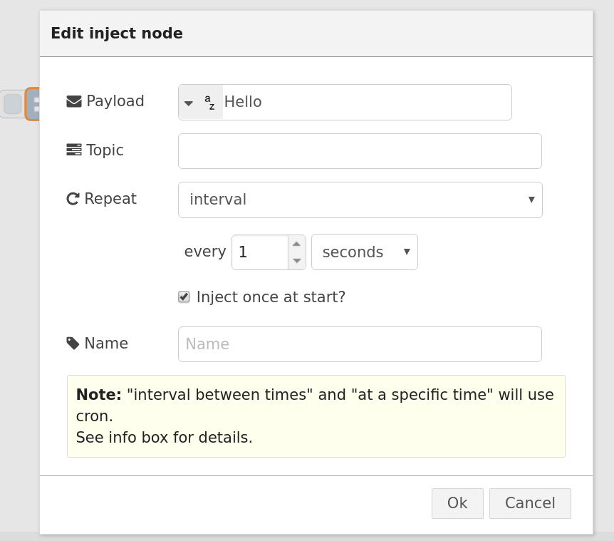
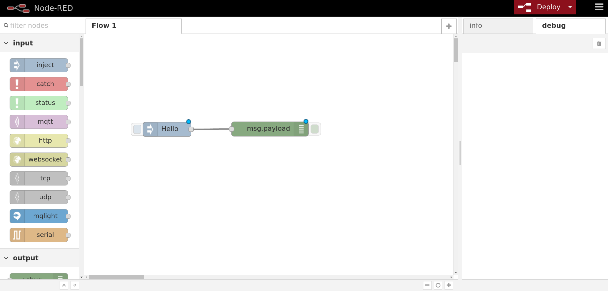

# Node.js與Node-RED介紹

## Node.js

因為接下來我們將使用的Bluemix一系列教學將會使用到Node.js作為主要語言，
所以我們就來談談Node.js這個程式語言吧！



首先是一些入門教學網站：
http://www.nodebeginner.org/index-zh-tw.html
http://www.tutorialspoint.com/nodejs/

相比起其他語言，Node.js算是年紀相對輕的，
最早於2009年首次釋出在Linux作業系統上，
一直到發展到現在在各大平台皆適用，
並與瀏覽器的引擎發展息息相關。

Node.js基於javascript可以用來做伺服器端或者網路相關的應用,
並且還可以搭配許多模組快速開發及進行各種實做，
與Python類似的，Node.js有一個專屬的套件管理，叫做NPM（Node Package Manager），
讓使用者可以輕鬆的通過一行指令就下載並安裝相對應的套件，
同時也能將自己的套件打包好上傳到雲端，
將來我們要使用IBM Bluemix的套件時將會用到同樣的原理。

整體來說，在接下來的IBM Bluemix開發都會在雲端上進行，
所以您的電腦上並不需要安裝Node.js，
但是為了進行本章範例的操作，
請您從官方網站下載Node.js並安裝。


https://nodejs.org/en/download/

安裝完成後，請打開Terminal（終端機）輸入"node"，
您將會看到一個跟python shell十分相似的互動式命令列，
(正式名稱叫做REPL, Read-Eval-Print-Loop)
您可以直接在上面輸入一些指令並得到回應。


http://www.tutorialspoint.com/nodejs/nodejs_repl_terminal.htm

有了Node.js之後，我們先不急著開始寫我們的程式，
關於Node.js語法的特性不是本章著重的目標，
因為我們將介紹一種圖像化的開發界面---Node-RED。


## Node-RED

Node-RED 是由IBM Emerging Technology所製作，
一款基於Node.js並門用在物連網的視覺化套件，
裡面整合了許多的服務，甚至能擴充IBM Bluemix的雲端服務API。

Node-RED GitHub
https://github.com/node-red/node-red



如果要安裝Node-RED的話其實只要在Terminal（終端機）上輸入"npm install -g node-red"，
就可以從npm上下載套件並自動安裝了，另外請注意這像指令可能需要賦予超級使用者的權限，
如果是OS X/linux的使用者請在指令前面加上sudo，
Windows的使用者則是用管理者權限去執行命令提示字元（Windows下的命令列）。

安裝完成後,請在Terminal上輸入"node-red"，
您應該可以看程式會自動在http://127.0.0.1:1880/  下生成一個server，
請您用瀏覽器打開此網址，成功進入Node-RED的樣子如下：


## Node-RED 一下

最後我們就來試試一些簡單的範例，並藉此了解Node-RED的操作模式與特性吧！
請先在左邊Input的欄位拉出一個inject元件，
您會發現在拖曳完成後它會變成了timestamp，
這是代表了一個時間戳記（對應到每一次的輸入），



您可以用滑鼠雙擊timestamp的元件看到裡面的inject設定，



點擊payload您可以看到裡面有許多種資料類型可以去設定，
在個範例中我們先試著輸出文字，所以請點選string那一欄，
並輸入"Hello"，並把下方的Repeat設定成interval，
預設會每1秒送出一次訊息。





接下來再從output那一欄拉出debug這個元件，
您一樣會發現在完成拖曳後它會變成msg.payload，
意思是它會輸出msg的payload性質到右邊那欄的debug並顯示出來。



將兩個元件用線連起來之後，就完成了我們程式的佈置了，
接下來請您按下右上角的Deploy，
就能看到程式正常的運作了！


最後我們來介紹一個Node-RED相當不錯的功能，
就是可以直接將Node-RED的圖形化程式打包成json的形式，
再以複製貼上的方式將程式碼轉回圖像化的Node。

讓我們來試試官方提供的範例程式碼，
請將以下的json碼複製起來，

```json
[{"id":"11b032a3.ee4fcd","type":"inject","name":"Tick","topic":"","payload":"","repeat":"","crontab":"*/5 * * * *","once":false,"x":161,"y":828,"z":"6480e14.f9b7f2","wires":[["a2b3542e.5d4ca8"]]},{"id":"a2b3542e.5d4ca8","type":"http request","name":"UK Power","method":"GET","url":"http://realtimeweb-prod.nationalgrid.com/SystemData.aspx","x":301,"y":828,"z":"6480e14.f9b7f2","wires":[["2631e2da.d9ce1e"]]},{"id":"2631e2da.d9ce1e","type":"function","name":"UK Power Demand","func":"// does a simple text extract parse of the http output to provide an\n// object containing the uk power demand, frequency and time\n\nif (~msg.payload.indexOf('<span')) {\n    var dem = msg.payload.split('Demand:')[1].split(\"MW\")[0];\n    var fre = msg.payload.split('Frequency:')[1].split(\"Hz\")[0];\n\n    msg.payload = {};\n    msg.payload.demand = parseInt(dem.split(\">\")[1].split(\"<\")[0]);\n    msg.payload.frequency = parseFloat(fre.split(\">\")[1].split(\"<\")[0]);\n    \n    msg2 = {};\n    msg2.payload = (msg.payload.frequency >= 50) ? true : false;\n\n    return [msg,msg2];\n}\n\nreturn null;","outputs":"2","valid":true,"x":478,"y":828,"z":"6480e14.f9b7f2","wires":[["8e56f4d3.71a908"],["cd84371b.327bc8"]]},{"id":"8e56f4d3.71a908","type":"debug","name":"","active":true,"complete":false,"x":678,"y":798,"z":"6480e14.f9b7f2","wires":[]},{"id":"cd84371b.327bc8","type":"debug","name":"","active":true,"complete":false,"x":679,"y":869,"z":"6480e14.f9b7f2","wires":[]}]
```


